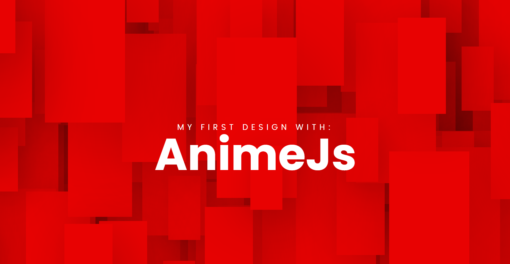

<!-- Projeto Finalizado -->
# 🔻 Animação com Anime.js
<p align="center">
  <!-- Contador de linguagens do GitHub -->
  
  <!-- Tamanho do repositório no GitHub -->
  
  <!-- Licença do GitHub -->
  
</p>

<div align="center">
  
</div>

## 🛠️ Tecnologias Utilizadas
- **HTML5**: Estrutura básica do projeto.
- **CSS3**: Estilização dos elementos da página.
- **JavaScript**: Lógica de animação utilizando Anime.js.
- **Anime.js**: Biblioteca para animações JavaScript.

## 🔍 Visualize o Projeto
Confira o projeto online através deste [link](https://devandreotti.github.io/js-background/).

## 🧭 Guia de Implementação
1. **Clone o Repositório**
   ```bash
   git clone https://github.com/devAndreotti/js-background.git
   ```
2. **Abra o Projeto**
   - Abra o arquivo `index.html` em um navegador.
  
## 📚 Recursos Adicionais

- [Anime.js Documentação](https://animejs.com/)
- [CSS Animations](https://developer.mozilla.org/en-US/docs/Web/CSS/CSS_Animations)

## 💪 Como Contribuir
Contribuições são bem-vindas! Siga estas etapas para colaborar:
1. Faça um fork do projeto.
2. Crie uma nova branch para sua feature: `git checkout -b feature/nome-feature`.
3. Commit suas mudanças: `git commit -m 'Adiciona nova feature'`.
4. Envie para a branch: `git push origin feature/nome-feature`.
5. Abra um Pull Request.

## 📌 Nota
Este projeto é para fins educacionais e demonstra a manipulação dinâmica de estilos com CSS e JavaScript. Sinta-se livre para explorar, modificar e adaptar conforme necessário.
